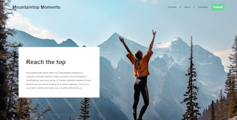
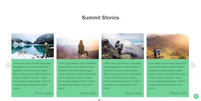
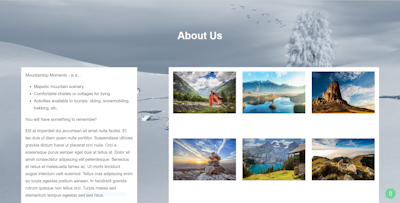
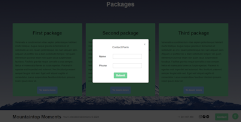

# Mountaintop Moments

Mountaintop Moments is a web application (landing page) built with React. Promoting luxury weekend getaways in the mountains.

<p float="left">
  
  
</p>
<p float="left">
  
  
</p>

## Technologies
- React.js
- CSS3
- HTML5
- npm (Node Package Manager)

## Possibilities

**Main**:
- Clickable "Mountaintop Moments" logo.
- Navigation: Reviews, About us, Packages.
- Up button for fast page scrolling.
- Modal window with contact and thank you form.

**Main banner**:
- Majestic mountain image.
- Brief attractive description.

**Reactive Slider**:
- Show customer testimonials with photos.
- Smooth transition.

**About Us & Packages**:
- Photo gallery with lightbox.
- Description of the services offered.

**Footer**:
- Clickable phone with the ability to dial from the browser.
- Icons-links of social networks.
- Copyright with automatic year calculation.

## How to run

To run the project locally, run the following commands:

1. Cloning a repository:  ```https://github.com/vero-git-hub/mountain-moments.git```
2. Install dependencies: ```npm install```
3. Launch of the project: ```npm start```

Runs the app in the development mode.\
Open [http://localhost:3000](http://localhost:3000) to view it in your browser.